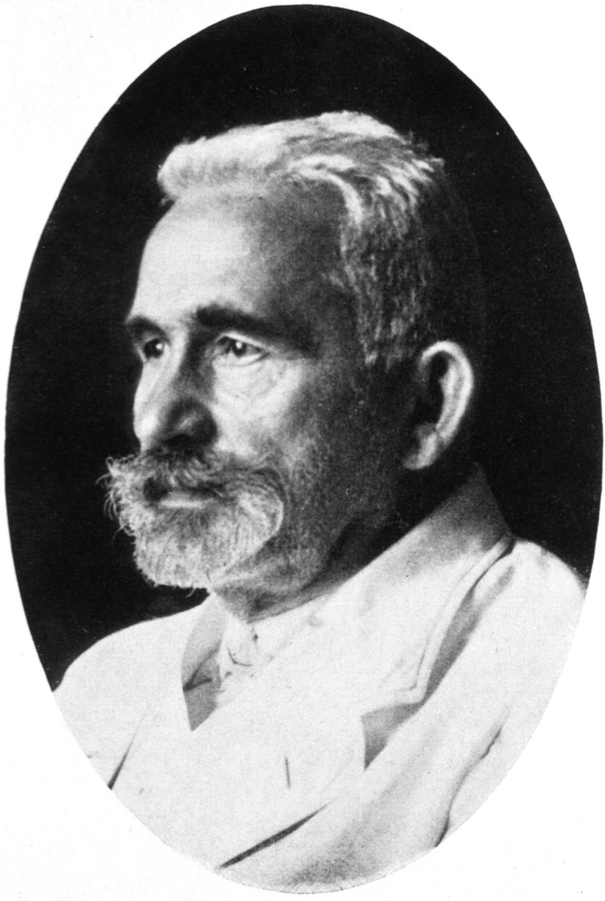

# Emil Kraepelin e a Demência Precoce

{width="500"}

A esquizofrenia é um transtorno complexo. Mas o início de sua história é inequívoco. Começa em 1893, quando o psiquiatra alemão Emil Kraepelin introduziu o termo *Dementia Praecox* como uma entidade diagnóstica na quarta edição de seu livro texto de psiquiatria, no capítulo de *Processos Degenativos* [@Hoenig1999]. Esse termo, que significa demência precoce, foi usado pela primeira vez nesta forma latina em 1891 por Arnold Pick (1851-1924), professor de psiquiatria na filial alemã da Universidade Charles em Praga [@Falkai2015] e também pelo psiquiatra francês Augustin Morel. Mas foi popularizado por Kraepelin ao descrever uma condição que afetava principalmente adolescentes, com uma rápida deterioração das funções psíquicas e uma evolução crônica e desfavorável [@Hoenig1999], criando a estrutura conceitual que deu origem ao conceito moderno de esquizofrenia [@Andreasen2011].

Embora esse nome seja relativamente novo na história da medicina, os sintomas a que esse diagnóstico se referem são muito antigos. Síndromes psicóticas foram reconhecidas desde pelo menos o primeiro milênio BC [@Andreasen2011]. Entretanto, o conceito de psicose sempre foi vago e muito abrangente. Na segunda metade do século 19, o termo psicose era sinônimo de *transtorno mental*, *doença mental* e *insanidade* [@Burgy2008]. Uma das muitas grandes contribuições de Kraepelin foi dividir o conceito geral de psicose em dois grupos principais, com base em sua observação de diferenças de curso e resultado. Kraepelin acreditava não haver nenhum sintoma isolado que pudesse ser patognomônico ou necessário para o diagnóstico, reconhecendo a importância do curso dos sintomas para o diagnóstico. A idéia de que a evolução dos sintomas era um elemento fundamental na distinção entre os diagnósticos psiquiátricos já havia sido proposta por Karl Ludwig Kahlbaum [@Hoenig1999]. Kahlbaum acreditava que a classificação diagnóstica em psiquiatria deveria levar em consideração não apenas a apresentação transversal dos sintomas, mas também seu início, seu curso, a sequência dos sintomas, as síndromes ao longo do tempo e seu desfecho [@Hoenig1999]. Usando esse critério de evolução temporal, Kraepelin notou haver dois processos distintos em curso: um grupo de pacientes psicóticos tinha um curso episódico, tipicamente com uma remissão completa dos sintomas; um segundo grupo de pacientes psicóticos tinha um curso crônico e progredia para um estado deteriorado. Ele chamou esses dois grupos de *maníaco-depressivo* e *Dementia Praecox* [@Andreasen2011]. Essa distinção, tão familiar hoje, foi uma grande conquista intelectual na época e influenciou as atuais classificações psiquiátricas e o próprio conceito de esquizofrenia dos dias atuais [@Andreasen2011]. Foi na sexta edição desse livro, em 1899, que Kraepelin propôs essa diferenciação entre esse dois importantes diagnósticos na psiquiatria [@Hoff1999], tendo descrito diversos subtipos da *Dementia Praecox*, entre eles, o subtipo hebefrênico, catatônico e paranoide, que se mantiveram com esses mesmos nomes até a CID-10.

Para Kraepelin, os aspectos mais importantes do quadro que chamou de *Dementia Praecox* eram os sintomas nas esferas cognitivas e emocionais, tais como alogia, avolição, anedonia, achatamento do afeto e prejuízo na capacidade de atenção [@Andreasen2011]. Apesar disso, ele não elencava nenhum desses sintomas como patognomônicos da *Dementia Praecox*. Entretanto, apesar da advertência de Kraepelin quanto a impossibilidade de diagnosticar e diferenciar a *Dementia Praecox* da *Psicose Manico Depressiva*, a busca pelos sintomas específicos de cada uma dessas entidades teria ainda uma longa jornada.

## Kraepelin e o status epistemológico dos diagnósticos psiquiátricos

Kraepelin acreditava na existência de doenças naturais ("natural kinds"), ou seja, acreditava que as diferentes síndromes de transtornos mentais poderiam representar diferentes doenças, que seriam eventualmente detectadas pelos pesquisadores [@Hoff2015]. Entretanto, essa ideia de que os diagnósticos psiquiátricos representem doenças (natural kinds) vem sendo criticada vigorosamente desde essa época. Depois da segunda guerra mundial as idéias de Kraepelin perderam sua influência e passaram a ser discutidas apenas como elementos da história da psiquiatria, mas a partir das décadas de 1960-1980, com o nascimento da "psiquiatria biológica", surgiu novamente a crença de que seria possível identificar as bases biológicas dos transtornos mentais [@Hoff2015].

A grande questão que ainda assola a psiquiatria é justamente a dúvida se os diagnósticos baseados nos fenomenos psicopatológicos são adequados para classificarmos as diferentes doenças (natural kinds)[@Hoff2015]. Atualmente os sistemas de classificação psiquiátrica declaram explicitamente que as categorias diagnósticas não devem ser consideradas entidades naturais, mas que são simplesmente convenções que ainda necessitam de verificação [@Hoff1999; @Hoff2015; @DSM-IV; @Moller2009 ].
