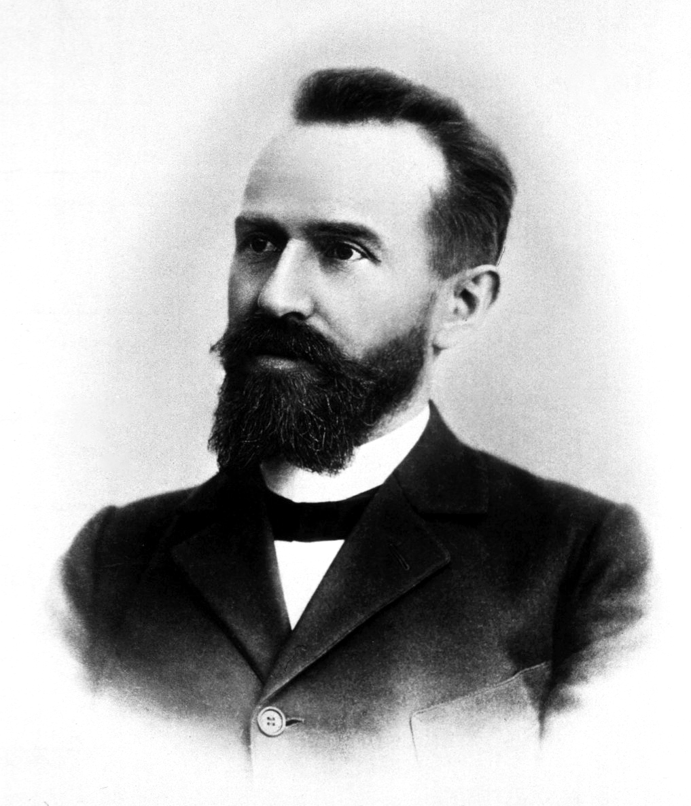

# Eugen Bleuler e o Grupo das Esquizofrenias

{width="500"}

Apesar das idéias de Kraepelin terem muito influentes na psiquiatria por oferecerem uma nosologia pragmática e clinicamente orientada, não foram muito bem aceitas no início. Foi somente alguns anos mais tarde, com a publicação do livro *"Dementia Praecox or the Group of Schizophrenias"* de Eugen Bleuler em 1911 e com a edição da 8ª edição do livro texto de Kraepelin em 1913, é que esses conceitos começaram realmente a se disseminar [@Hoenig1999]. Embora Kraepelin e Bleuler sejam frequentemente contrastados entre si, a visão dos sintomas característicos da esquizofrenia deles é semelhante em diversos aspectos. Tal como Kraepelin, Bleuler acreditava que os delírios e as alucinações não eram características centrais da doença, tendo relegados esses sintomas a um status acessório ou secundário[@Andreasen1994; @Hoff2012]. Além disso, tanto Kraepelin quanto Bleuler enfatizaram a importância dos déficts cognitivos, afetivos, volitivos e da atenção na esquizofrenia. Entretanto, a *Dementia Praecox* de Kraepelin e a *Esquizofrenia* de Bleuler não eram exatamente a mesma síndrome. O conceito de Kraepelin era puramente observacional e empírico, evitando qualquer teoria sobre os sintomas, enquanto Bleuler tinha uma teoria sobre a origem de cada conjunto de sintomas, fundamentando-se nas teorias da psicanálise para "compreender" os sintomas dos pacientes. Além disso, enquanto Kraepelin não listava nenhum sintoma obrigatório ou necessário para o diagnóstico, Bleuler acreditava haver sintomas fundamentais, que estariam sempre presentes apenas na esquizofrenia e seriam característicos apenas da esquizofrenia [@Andreasen2011; @Hoff2012].

Bleuler não concordava com o nome *Dementia Praecox*, pois entendia que nem sempre haveria uma deterioração cognitiva e nem sempre o início era precoce, tendo então usado o termo *Esquizofrenia* para nomear essa condição, representando o que entendia ser o fenômeno fundamental: a fragmentação (dissociação) das funções mentais [@Hoff2012].

> I wish to emphasize that in Kraepelin’s dementia praecox it is neither a question of an essential dementia nor of a necessary precociousness. For this reason, and because from the expression dementia praecox one cannot form further adjectives nor substantives, I am taking the lib- erty of employing the word schizophrenia for revising the Kraepelinian concept. In my opinion the breaking up or splitting of psychic functioning is an excellent symptom of the whole group \[...\] (citado por @Maatz2015).

Ao criar o "grupo das esquizofrenias", Bleuler ampliou o conceito inicial de Kraepelin, incluindo casos que começavam mais tarde, casos com desfechos mais favoráveis e com curso e sintomas bastante heterogêneos. Além disso, na concepção de Bleuler, a esquizofrenia era caracterizada por sintomas **fundamentais**: anormalidades na associação, no afeto, na ambivalência, na relação com a realidade (autismo) [^3.bleuler-1].

[^3.bleuler-1]: É importante salientar que Bleuler usava o termo autismo numa conotação diferente a atual. Não havia nessa ocasião o conceito de autismo como um diagnóstico, mas sim como um sintoma. Para Bleuler, o pensamento autista era caracterizado por desejos infantis de evitar realidades insatisfatórias e substituí-las por fantasias e alucinações (Bleuler, 1950\[1911\]: 63). Psicólogos, psicanalistas e psiquiatras na Grã-Bretanha usaram a palavra autismo com este significado ao longo da década de 1920 e até a década de 1950. A partir de meados da década de 1960, a palavra “autismo” passou a descrever exatamente o oposto do que significava até então. Enquanto na década de 1950 autismo se referia a alucinações e fantasias excessivas em crianças, na década de 1970 passou a significar uma completa falta de uma vida simbólica inconsciente. Michael Rutter, afirmou em 1972 que “a criança autista tem uma deficiência de fantasia em vez de um excesso” (Rutter, 1972 : 327). O significado da palavra autismo foi então radicalmente reformulado, passando de uma descrição de alguém que fantasiava excessivamente para alguém que não fantasiava nada.

> "Certain symptoms of schizophrenia are present in every case and at every period of the illness even though, as with every other disease symptom, they must have attained a certain degree of intensity before they can be recognized with any certainty. For example, the peculiar **association disturbance** is always present... As far as we know, the fundamental symptoms are characteristic of schizophrenia, while the accessory also appear in other types of illness." (Bleuler, citado por Andreasen [-@Andreasen1979].

No início de seu livro sobre o grupo das esquizofrenias Bleuler elenca o que considera como sintomas fundamentais:

> "*The fundamental symptoms consist of disturbances of association and affectivity, the predilection for fantasy as against reality, and the inclination to divorce oneself from reality (autism).*" (Bleuler, 1911/1952, p. 14 - citado por @McNally2009).

Bleuler também dava especial importância à alterações na atenção, na volição e no senso de identidade ou função do ego. Por outro lado, delírios, alucinações, sintomas catatônicos e distúrbios de orientação, atenção, memória, consciência e motilidade eram considerados sintomas acessórios [@Andreasen1982].

Um problema grave é que não havia nessa época uma definição uniformizada da maioria dos termos usados para descrever os sintomas da esquizofrenia [@Andreasen1979]. Nos países de língua alemã, a teoria da associação era um conceito epistemológico básico dos eventos mentais em geral, segundo o qual a vida mental consiste em múltiplas combinações (“associações”) de atos mentais e os *distúrbios de associação* descritos por Bleuer são fenômenos que hoje provavelmente chamaríamos de sintomas cognitivos[@Hoff2012]. O termo autismo não tinha naquela época a mesma conotação de hoje, sendo razoável imaginar que muitos pacientes que hoje seriam diagnosticados com autismo tenham sido classificados por Bleuler e Kraepelin como tendo esquizofrenia. Essa confusão na terminologia, associada às dificuldade de interpretação e tradução dos textos originais escritos na língua alemã acabaram por tornar ainda mais difícil definir os contornos do que seria essa nova entidade nosológica denominada agora de esquizofrenia.

As tentativas de sintetizar as ideias de Bleuler culminaram na década de 1960 com uma simplificação menemônica que ficou famosa na literatura da língua inglesa como os **Quatros As de Bleuler** [@McNally2009]: **A**pathy, **A**ssociative looseness, **A**utistic thinking, and **A**mbivalence (Apatia, frouxidão Associativa, pensamento Autista e Ambivalência). Entretanto, esses 4 sintomas são apenas apenas uma caricatura simplista das idéias Bleuler. Como salientou Andreasen:

> "A somewhat loose reading of Bleuler in the United States has given us the Bleulerian “Four A’s”: association, affect, autism and ambivalence. A closer reading indicates that he also comments on abnormalities in attention, volition and activity. Neverthless, based on a widely accepted (and probably incorrect) understanding of Bleuler, the last several generations of psychologists and psychiatrists have been taught to recognize schizophrenia in terms of the Four A’s and to see formal thought disorder as the most important among the fundamental symptoms". (@Andreasen1985, p. 199)

Durante a maior parte do século XX, a perspectiva de Bleuler predominou e a esquizofrenia passou a ser diagnosticada com base nos sintomas que Bleuler considerava fundamentais [@Andreasen2011; @Andreasen1979]. No entanto, devido às deficiências de clareza metodológica, essa a abordagem diagnóstica de Bleuler provocou uma enorme expansão do conceito da esquizofrenia [@Hoenig1983]. Como resultado, as tentativas de diagnosticar a esquizofrenia com esses conceitos culminaram com um excesso de diagnósticos de esquizofrenia nos estados unidos na primeira metade do século XX [@Kendell].

Comparações dos processos diagnósticos entre psiquiatras Britânicos e Norte-Americanos demonstraram uma diferença marcante, com um número muito maior de psiquiatras Norte-Americanos diagnosticando esquizofrenia quando confrontados com os mesmos pacientes [@Kendell; @Katz1969]. No estudo de Kendel e col. [-@Kendell], no qual videotapes de entrevistas de pacientes eram mostrados para psiquiatras Britânicos e Norte-Americanos, as discrepâncias foram enormes, como podem ser observado nas tabelas abaixo, acerca das entrevistas de dois pacientes, **E** e **F**:

| Diagnóstico                  | Psiquiatras Americanos (N = 27) | Psiquiatras Britânicos (N = 29) |
|------------------------------|---------------------------------|---------------------------------|
| Esquizofrenia                | 23 (85%)                        | 2 (7%)                          |
| Neuroses                     | 1 (4%)                          | 11 (38%)                        |
| Transtornos de Personalidade | 1 (4%)                          | 15 (52%)                        |

: Dados do paciente **E**, adaptada de [@Kendell]

| Diagnóstico                 | Psiquiatras Americanos (N = 133) | Psiquiatras Britânicos (N = 194) |
|-----------------------------|----------------------------------|----------------------------------|
| Esquizofrenia               | 92 (69%)                         | 4 (2%)                           |
| Transtorno de Personalidade | 10 (8%)                          | 146 (75%)                        |

: Dados do paciente **F**, adaptada de [@Kendell]

Essas inconsistências num diagnóstico tão importante na psiquiatria tinham repercussões enormes, tanto para o tratamento dos pacientes como na percepção pública da psiquiatria. A partir da década de 1960, a falta de precisão e inconsistência dos diagnósticos psiquiátricos começou a ganhar destaque na comunidade médica e científica. Em 1974 Spitzer e Fleiss publicam uma importante reanálise crítica sobre a confiabilidade dos diagnósticos psiquiátricos, destacando várias questões fundamentais, tais como a variabilidade diagnóstica, problemas metodológicos e a necessidade de padronização e operacionalização dos critérios, para melhorar a consistência dos diagnósticos psiquiátricos [@Spitzer1974]. Os questionamentos dessas décadas de 1960 a 1970 marcaram uma mudança na ênfase dos sintomas. Havia um interesse em melhorar a precisão e a confiabilidade do diagnóstico. Os sintomas psicóticos como delírios e alucinações, passaram a receber cada vez mais destaque, colocados na vanguarda da definição de esquizofrenia.

Como veremos no próximo capítulo, delírios e alucinações, relativamente fáceis de reconhecer e definir, acabaram se tornando os mais proeminentes no diagnóstico da esquizofrenia [@Andreasen2011].
