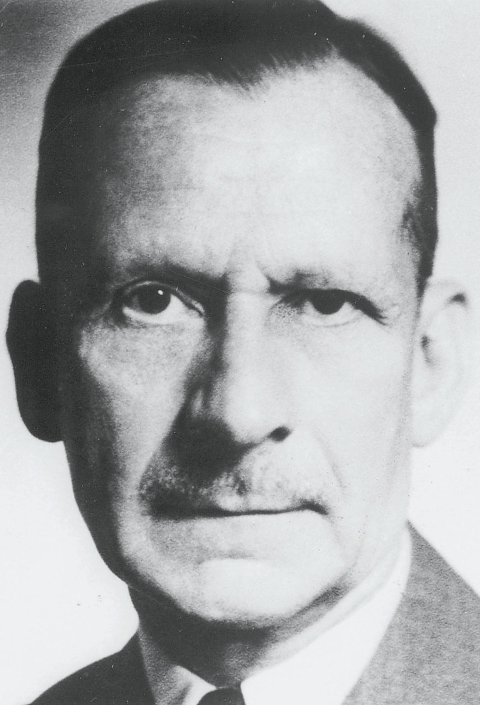

# Kurt Schneider e os Sintomas de Primeira Ordem

{width="500"}

Kurt Schneider, assim como Bleuler, desejava identificar sintomas fundamentais da esquizofrenia. Mas teve um enfoque radicalmente diferente de Kraepelin e Bleuler, enfatizando a importância de delírios e alucinações no diagnóstico da esquizofrenia. Influenciado por Karl Jaspers, que acreditava que a essência da psicose era a experiência de fenômenos **não compreensíveis**, isto é, sintomas que uma pessoa *"normal"* não poderia se imaginar vivênciando. Kurt Schneider concluiu que um componente crítico da esquizofrenia era a incapacidade de encontrar os limites entre o **eu** e o **não-eu** e a perda do senso de autonomia pessoal [@Schneider; @Andreasen2011]. Ele concebeu então o que chamou de **Sintomas de Primeira Ordem**, caracterizados em grande parte por esta perda de autonomia, ou perda da sensação da experiência do **eu** [@Andreasen2011; @Mellor1970].

O conceito de Sintomas de Primeira Ordem talvez tenha moldado a nossa visão atual da esquizofrenia mais do que os conceitos de qualquer outro psiquiatra antes dele [@Moritz2024]. Schneider resumiu a essência de suas idéias sobre a esquizofrenia em seu livro Klinische Psychopathologie (Psicopatologia Clínica - @Schneider1978):

> *"Enfatizamos acima esses sintomas de primeira ordem e os ilustramos com exemplos. Seguindo a ordem em que os revisamos, são eles: pensamentos audíveis, vozes ouvidas discutindo, vozes ouvidas comentando sobre as ações de alguém; a experiência de influências que atuam no corpo (experiências de passividade somática); retirada de pensamento e outras interferências com o pensamento; difusão do pensamento; percepção delirante e todos os sentimentos, impulsos (pulsões) e atos volitivos que são vivenciados pelo paciente como obra ou influência de terceiros. Quando qualquer um destes modos de experiência está inegavelmente presente e nenhuma doença somática básica pode ser encontrada, podemos fazer o diagnóstico clínico decisivo de esquizofrenia"* (Schneider pp. 133–134)

As ideias de Schneider baseavam-se apenas na observação clínica e não pesquisas, com intenção de identificar os sintomas que podem ser avaliados de forma confiável, em detrimento daqueles sintomas que mostram apenas uma fraca correspondência entre avaliadores:

> *“Sem dúvida, outros sintomas esquizofrênicos de primeira ordem podem ser encontrados, mas estamos nos limitando àqueles que podem ser claramente definidos. e pode ser apreendido sem muita dificuldade em uma investigação clínica”* (Schneider pp. 133–134).

Ele não pretendia estabelecer uma nova teoria da esquizofrenia mas apenas possibilitar diagnósticos (diferenciais) confiáveis ​​

> *“O valor desses sintomas está, portanto, apenas relacionado ao diagnóstico; eles não têm nenhuma contribuição particular a dar à teoria da esquizofrenia”* (Schneider pp. 133).

## Sintomas de Primeira Ordem (SPO) de Kurt Schneider

| \#  | Sintoma                                  | Descrição                                                                                             |
|:---------------:|-----------------|--------------------------------------|
|  1  | Pensamentos audíveis (eco do pensamento) | Vozes falando pensamentos em voz alta. Eco do pensamento                                              |
|  2  | Vozes discutindo entre si                | Duas ou mais vozes alucinatórias discutindo o sujeito na terceira pessoa                              |
|  3  | Vozes comentando ações                   | Vozes descrevendo as atividades do sujeito enquanto ocorrem                                           |
|  4  | Influência no corpo                      | Experiência de sensações corporais impostas por uma agência externa                                   |
|  5  | Roubo de pensamento                      | Os pensamentos cessam e o sujeito simultaneamente os experimenta como removidos por uma força externa |
|  6  | Inserção de pensamento                   | Os pensamentos têm a qualidade de não serem próprios, atribuídos a uma agência externa                |
|  7  | Transmissão de pensamento                | Os pensamentos escapam para o mundo exterior onde são experimentados por outros                       |
|  8  | Sentimentos impostos                     | Os sentimentos não parecem ser próprios, atribuídos a uma força externa                               |
|  9  | Impulsos impostos                        | O impulso parece ser estranho e externo                                                               |
| 10  | Atos volitivos impostos                  | Ações e movimentos sentidos como estando sob controle externo                                         |
| 11  | Percepção delirante                      | A percepção normal tem um significado privado e ilógico                                               |

: Sintomas de primeira ordem de Schneider, de acordo com @Mellor1970.

## Ascenção e queda dos SPO

Esses sintomas, listados por Schneider e nomeados por ele de **Sintomas de Primeira Ordem**, tiveram uma enorme influência no conceito de esquizofrenia pois eram bem mais objetivos que os sintomas antes descritos por Kraepelin e Bleuler e se adequavam melhor à crescente necessidade de precisão e consistência diagnóstica [@Andreasen2011]. Essa especificidade contribuiu para a padronização diagnóstica e os critérios foram incorporados em vários instrumentos diagnósticos, tais como o *International Pilot Study of Schizophrenia* (IPSS), o *Present State Examination* (PSE) e posteriormente em vários manuais diagnósticos tais como o Research Diagnostic Criteria [@Endicott1978; @Andreasen2011]. A padronização promovida pelos critérios de Schneider ajudou a melhorar a consistência dos diagnósticos de esquizofrenia e influenciou a formulação do DSM-III, que buscou incorporar critérios diagnósticos mais claros e específicos para melhorar a confiabilidade.

No DSM-I, publicado em 1952, e no DSM-II, publicado em 1968, a influência do Bleuler e Kraepelin eram predominantes [@Moritz2024]. Nessas duas primeiras edições do DSM, as alucinações eram mencionadas como sintoma, mas sem nenhum nenhuma importância especial. Foi apenas na terceira edição do DSM, em 1980, que os critérios de Schneider passaram a ter um peso especial no diagnóstico, e mantiveram sua importância no DSM-IV de 1994 e na CID-10 [@Moritz2024; @Nordgaard2008].

No entanto, o DSM-III foi originalmente desenvolvido para ser um *"consenso provisório baseado no julgamento clínico"*, e não uma descrição completa das doenças [@Andreasen2011]. E infelizmente, como destacou Nancy Andreasen, esses critérios "acabaram por serem reificados e ganharam um poder que originalmente nunca pretenderam ter" [@Andreasen2011].

Nos últimos anos, entretanto, diversos autores começaram a questionar a valiadade dos Sintomas de Primeira Ordem de Schneider no diagnóstico da esquizofrenia. Nordgaard e col. [-@Nordgaard2008] apontaram diversos problemas com o uso desses sintomas, concluindo não haver evidências nem para confirmar nem para rejeitar a validade desses sintomas, tendo proposto que esses sintomas passasem a ter sua importância diminuida nas proximas revisões da CID e do DSM. Uma revisão do grupo Cochrane [@Soares-Weiser2015] avaliou a especificidade e a sensibilidade dos sintomas de primeira ordem de Schneider em cerca de 21 estudos. A sensibilidade dos sintomas de primeira ordem para o diagnóstico da esquizofrenia variou de 50.3% a 71% e a especificidade variou de 65.2% a 97.2%. Como consequência, tanto o DSM-V quanto a CID-11 reduziram a importância dos sintomas de primeira ordem para o diagnóstico da esquizofrenia [@Gaebel2012].

Os critérios de Schneider trouxeram uma série de problemas. Embora fossem elogiados por sua especificidade, pesquisas posteriores mostraram que sintomas semelhantes podiam ocorrer em outros transtornos mentais, o que comprometia a exclusividade dos critérios para a esquizofrenia. Além disso, Schneider focou principalmente nos sintomas positivos, como alucinações e delírios, negligenciando os sintomas negativos e cognitivos da esquizofrenia, que também são críticos para um diagnóstico compreensivo. Embora os critérios de Primeira Ordem de Kurt Schneider tenham uma tentativa pioneira de aumentar a confiabilidade dos diagnósticos psiquiátricos, oferecendo uma base mais específica para o diagnóstico de esquizofrenia, suas limitações também destacaram a necessidade de abordagens mais abrangentes e integradas.
