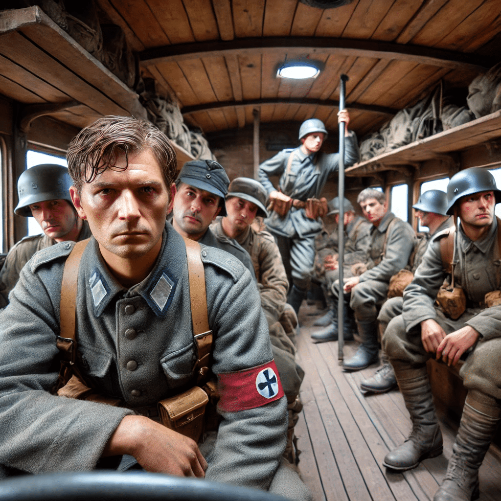
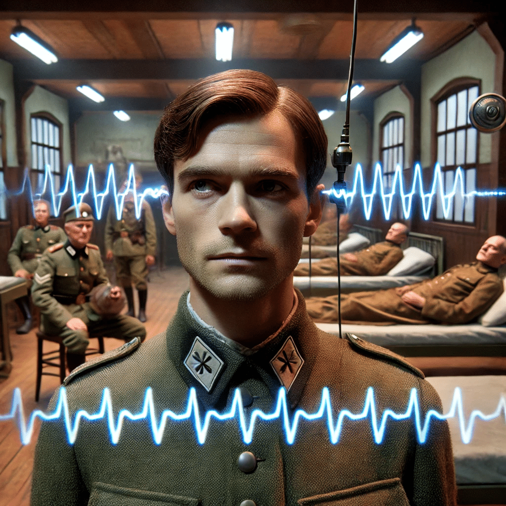

# Casos Clínicos

Os casos descritos a seguir foram extraídos do livro "La Esquizofrenia Incipiente. Intento de un Análisis de la forma del delírio" de Klaus Conrad [@Conrad]. Todos os pacientes descritos nessa obra são militares que estiveram internados na instituição psiquiátrica onde Conrad atuava, durante os anos de 1941 - 1942. A primeira história, caso nº 69, é de um militar denominado de Ranier N, de 20 anos de idade [@Conrad, pag. 19-29]. A segunda história, caso nº 10, é do militar denominado de Karl B, de 32 anos de idade [@Conrad, pag. 69-70, 129-130]. Esses casos mostram a "reorganização dos significados" que Conrad descreve no início da Esquizofrenia [@Mishara].

## O caso Ranier

Ranier N, nascido em 1921. Deu entrada no hospital psiquiátrico no dia 29 de janeiro de 1941, aos 20 anos de idade. Apresentava um grave delírio de referência. Acreditava que todos sabiam seus pensamentos, se mostrava bastante desconfiado e as vezes ficava agitado. Seu estado melhorou lentamente ao longo de 8 semanas de internação. Depois de melhorar contou como seu quadro se desenvolveu.

Ranier começou a trabalhar como militar no exército alemão em 1940. Desejava seguir carreira de oficial, mas tinha receio de não conseguir. Logo começou a perceber que “havia algo estranho”, mas não sabia o que. Aos poucos começou a notar “rumores” de que ele iria ser o chefe da companhia. Ouvia esses rumores sobre o próximo chefe e, embora seu nome não fosse dito, passou a acreditar que se referiam a ele. Passou a sentir uma certa inimizade entre os colegas, e atribuia issa a uma inveja. Pouco a pouco passou a sentir que todos se voltavam contra ele. Certo dia o capitão da companhia lhe disse “coloque-os em ordem, você é o responsável”. Ele percebeu que essa era uma alusão à sua ascensão profissional.

Passou a não mais conversar com ninguém, pois temia a inveja dos colegas. Passou a notar que os colegas o observavam de forma estranha. Certa noite ouviu uma conversa de que os colegas o levariam para o campo, o amarrariam numa árvore e o queimariam com um ferro em brasa. Por medo, decidiu passar a noite em claro para poder se defender caso isso viesse a acontecer. Nessa noite começou a ouvir os passos de pessoas se aproximando ao redor de sua barraca, mas sempre que se levantava tudo ficava em silêncio novamente. Às vezes acendia a luz de sua barraca, mas não via nada, concluía então que todos se escondiam. Passou a noite toda acordado e vigilante. De manhã sentia haver uma certa inimizade entre ele e os colegas. Quando seu melhor amigo perguntou “o que se passa”, notou que todos se viraram para ele, “para ver como iria reagir”.

Sentia que tudo era uma ameaça. Percebeu que todos estava contra ele. Quando foi tomar banho, o jarro de água tinha desaparecido, quando se dirigia a algum lugar, alguém obstruía seu caminho. Passou a notar que faziam gestos para ele, sentia que eram todos grosseiros com ele. Percebeu que até seus melhores amigos passavam a se desviar dele aos poucos até o abandonarem totalmente e passou a se sentir completamente só.

Foi então levado até a enfermaria e, enquanto o tenente falava com ele, teve a sensação de que tramavam um plano para que ele deixasse de pensar em ser promovido. Queriam expô-lo ao ridículo em público. Quando os médicos solicitaram que ele se deitasse na maca e tomasse um comprimido, então pensou que essa medicação iria servir para provocar artificialmente um estado febril nele.

Ao ser levado para o carro, passou a acreditar que queriam dar a ele uma nova oportunidade. Sentia que estava sendo colocado a prova para poder finalmente ser um oficial do exército. Mas quando lhe ofereceram um cigarro pensou que havia ali alguma substância para paralisar sua vontade ou para enganá-lo de alguma forma. Em certo momento o motor do carro começou a falhar e ele então passou a acreditar que isso era um sinal de que havia uma trama contra ele. Em outro momento viu uma placa com a letra “N” e percebeu que esse era um sinal que significava “NÃO” e que queria dizer que ele não tinha mais esperanças. Ao passarem por uma cidade cunho nome significava “montanha acima” e interpretou essas coisas como “sinais” de que havia novamente esperança.

Quando chegou no hospital, acreditou estar num campo de concentração. Sentia que todos o observavam e que sabiam detalhes de sua vida pessoal. Em certo momento, pode ouvir a voz de seu comandante e de seu coronel e teve a certeza de que tramavam seu assassinato, que o degolariam como um animal. Quando encontrou com o médico essa certeza se confirmou quando viu uma seringa no bolso do paletó do médico. Quando foi colocado na cama da enfermaria teve a sensação de que estavam lendo seus pensamentos, que todos sabiam o que ele pensava.

Alguns dias depois, relatou que se sentia confuso, com as lembranças de tudo que viveu nos últimos dias um pouco “esfumaçadas”. Continuava sentindo que todos conseguiam ler seus pensamentos, que vigiavam seus pensamentos. Sentia que, sempre que pensava em fugir do hospital tinha a sensação de que era observado com mais intensidade e de que o cercavam para impedir sua fuga. Ranier então tentava ficar pensando apenas em coisas inofensivas para não chamar atenção da equipe. Certo dia, num momento de angústia, cortou os pulsos para se matar, pois “preferia morrer a viver aquele lento martírio”. Pensava que, apesar de estar sozinho, as pessoas saberiam o que tinha feito por causa da transmissão de pensamento que estava imaginando ocorrer.

Sentia-se muito incomodado durante a noite, pois sentia que observavam constantemente seus pensamentos. Acreditava que os outros pacientes dormiam muito durante o dia para poderem observar melhor seus pensamentos durante a noite. Notava também que quando pensava algumas coisas em particular as pessoas tossiam de forma intencional e que quando pensava em se barbear via que algum outro pacientes passava a mão pela face e dizia pra ele que tinha feito a barba.

Certo dia, ainda internado, teve a pensamento de que isso tudo era uma prova para ver se ele tinha condições de ser um oficial. Entendeu então que que queriam educa-lo a “fazer dele um homem”.

Percebeu que sempre exigiam dele uma decisão. Certa vez viu um queijo sobre a mesa e notou que havia gotas de líquido sobre o queijo. Com isso teve a certeza de que era um sinal de que ele devia se arriscar. Decidiu então que precisava lutar para mostrar que era também fisicamente capacitado para ser oficial. Passou então a iniciar brigas com frequência em sua ala do hospital. Temia que o mudassem para a ala de pacientes mais tranquilos, pois assim perderia a oportunidade de mostrar suas capacidades. Pensava sempre “tenho que voltar a lutar, tudo está em jogo, exigem isso de você”. Durante esse período não se sentia humilhado ou deprimido, mas pelo contrário, sentia-se orgulhoso por sentir que era tratado como um inimigo de respeito. Passou a acreditar que sua nação somente poderia durar eternamente se todos homens passassem a ser educados dessa mesma forma que acontecia aqui com ele. E sentia que, se perseverasse, conseguiria se tornar o oficial que desejava.

Depois de alguns dias, entretanto, sentiu que suas forças o deixavam. Não era mais capaz de resistir. Não conversava mais com ninguém. Já não tinha mais esperanças. Estava esperando a morte. Sentia-se acabado física e mentalmente. Sentia haver falhado em definitivamente. Não tinha mais esperanças de ser um dia oficial. Estava deprimido e com sentimentos de inferioridade.

Recebeu alta depois cerca de 2 meses de internação. Três semanas depois o paciente escreveu uma carta para o médico contando não ter mais o sentimento de que estava sendo observado, que estava feliz por se ver livre desse sentimento. E agradeceu ao médico pela ajuda durante a internação apesar de nunca ter aceitado tal ajuda durante o tratamento.

## O caso de Karl

Karl B., um homem de 32 anos, começou a experimentar os primeiros sintomas de esquizofrenia durante uma viagem militar. Na manhã em que seu batalhão partiria, percebeu que algo estava estranho. O suboficial pediu a chave do barracão, e Karl imediatamente sentiu que isso era uma manobra para "testá-lo". A viagem de ônibus, que durou de três a quatro horas, foi repleta de comportamentos "suspeitos" por parte de seus companheiros. Ele notou que eles agiam como se soubessem algo que ele não deveria saber. Karl achou bastante estranho quando um deles perguntou "se ele tinha pão".

Ao chegarem ao destino, alguns colegas foram encarregados de buscar alojamento, o que Karl interpretou como uma tentativa de instruí-los sobre como deveriam se comportar em relação a ele. Durante esse tempo, ele ficou no ônibus, observando as idas e vindas de seus companheiros, convencido de que todos estavam recebendo instruções sobre como lidar com ele.

No final do dia, Karl desceu à rua para comprar cigarros e passou por um jardim onde estavam sentados suboficiais e sargentos. Ele notou que um dos suboficiais entrou em um carro e partiu, o que o fez acreditar que seria feito um relatório de sua conduta ao escritório superior. Mais tarde, naquele mesmo dia, quando entrou no pub onde haviam combinado de se encontrar, Karl percebeu que tudo estava preparado para testá-lo. A orquestra, a mulher que vendia cigarros, e até as conversas dos seus companheiros pareciam ter sido pré-combinadas para observá-lo. Enquanto tomava cerveja com seus colegas, estava convencido que cada um deles tinha uma missão e tudo que falavam parecia ter sido previamente combinado. Quando algum dos colegas perguntava algo a ele, Karl acreditava que era um plano para obter informações sobre ele. Quando os colegas conversavam entre si, ele acreditava que estavam falando sobre ele.

Na manhã seguinte, Karl foi ao alojamento de um colega para fazer a contabilidade da seção de tanques, mas encontrou o quarto fechado e luzes acesas no porão. Isso lhe pareceu mais uma preparação para testá-lo. Quando finalmente entrou no quarto, seu colega o cumprimentou e Karl entendeu que eram insinuações veladas de que ele era homossexual. Durante a contabilidade dos tanques, Karl ficou convencido de que estavam lendo documentos secretos sobre uma missão relacionada a ele. As coisas continuaram a acontecer de forma secreta e dissimulada, aumentando sua sensação de perseguição.

Um incidente com um sargento, onde Karl teve receio de encher um galão de gasolina, fez com que fosse levado aos superiores para dar explicações. Contou toda a história que percebia estar acontecendo e acabou sendo encaminhado ao hospital. Durante a ida para o hospital, Karl notou muitos objetos na rua que pareciam estar lá apenas para que ele pudesse observá-los: montes de palha, pedras, e até um cordeiro à beira do caminho. Para ele, cada detalhe estava lá para testá-lo, e sentia que o sargento o observava com cuidado.

No hospital, Karl ficou surpreso com a precisão das perguntas dos médicos, como se eles já soubessem as respostas. Ele percebeu que mesmo na rua, os civis franceses pareciam estar instruídos sobre como se comportar em relação a ele. Todos, desde seus companheiros no cabaré até os transeuntes, pareciam agir de maneira particular e coordenada.

Durante sua estadia no hospital de Santa Ana em Paris, odde passou passou dez dias, sentia haver um "círculo encantado" ao redor dele, e acreditava ser capaz de hipnotizar as pessoas ao seu redor.

Quando ele chega ao hospital militar de Conrad, as delírios progrediram do espaço externo para o espaço interno de seu corpo. O paciente relata que um "aparelho de ondas" controlava seus movimentos a alguma distância através da correntes elétricas ajustada por um mostrador. Segundo ele, a corrente tinha controle insignificante sobre seus movimentos, preservando seu "livre arbítrio". E que noutro momentos, para ter controle completo, a máquina "entra" comanda.

