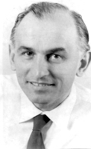

# Klaus Conrad e o Trema

{width="500"}

Klaus Conrad (1905-1961) trouxe contribuições significativas para o estudo do início da esquizofrenia, oferecendo uma perspectiva única e detalhada sobre as fases iniciais do transtorno. Suas observações clínicas e teóricas se concentraram nos estágios prodrômicos da esquizofrenia, enfatizando a importância dos sintomas iniciais e das mudanças sutis na percepção e no pensamento dos pacientes. Enquanto Kraepelin estabeleceu a base para a distinção entre esquizofrenia e outros transtornos mentais, Bleuler introduziu o termo "esquizofrenia", e listou o que chamou de \*sintomas fundamdentais\*, e Schneider se concentrou na especificidade dos sintomas de Primeira Ordem para melhorar a confiabilidade diagnóstica, Conrad abordou os processos subjetivos vivenciados pelos pacientes no início da doença, incluindo a fase de trema, que descreve uma sensação de iminência de uma mudança catastrófica. As contribuições de Conrad enriquecem a compreensão da esquizofrenia ao incorporar aspectos temporais e fenomenológicos, destacando a complexidade e a variabilidade do transtorno. Essa abordagem mais integrada e evolutiva sublinha a importância de uma perspectiva multidimensional na psiquiatria contemporânea.

Klaus Conrad documentou cuidadosamente os relatos de 107 soldados alemães diagnosticados com primeiro episódio de esquizofrenia que haviam sido internados num hospital militar durante os anos de 1941 - 1942 [@Conrad, pag. 37]. A partir desses relatos, propôs que a formação e manutenção de delírios seguem alguns estágios, representando uma progressão gradual da psicose, culminando na formação de um sistema delirante complexo e coeso [@Mishara]. Cada estágio envolvendo um processo contínuo de reorganização dos significados [@Mishara].

O estado inicial, caracterizado por uma sensação de estranheza e inquietude, marcando o início da transformação da percepção do paciente, é o que Conrad chamou de "Trema", termo que indica a tensão vivida por atores antes de subir no palco [@Conrad]. Conrad usou esse termo para se referir ao estado de tensão emocional e perplexidade que precede a formação dos delírios. A fase seguinte, na qual há um atribuição de significados aos eventos, Conrad denominou de Apofania. As outras fases descritas por Conrad, Apocaliptica, Consolidação e Resíduo tiveram pouca validação empírica e são pouco citadas na literatura atual [@Mishara].

## Trema

Esse período inicial, no qual o paciente sente haver "alguma coisa errada ou estranha acontecendo", pode durar dias, meses ou até anos. O paciente experimenta uma tensão cada vez mais opressiva, "um sentimento de não finalidade" ou expectativa. Sente que algo está "no ar", mas é incapaz de dizer o que mudou [@Mishara]. Há uma sensação de que tudo ao redor parece sinistro, misterioso, peculiar, de uma forma indefinível. Sabe que está pessoalmente envolvido no que percebe, mas ainda não sabe como. Há uma antecipação de que algo irá acontecer, algo irá se revelar. Além desse sentimento de antecipação, pode haver também desconfiança, medo, inibição depressiva, culpa, um sentimento de separação dos outros e, muitas vezes, uma combinação destes [@Mishara]. Conrad descreve que nessa fase há *condutas sem sentido*, *sentimentos depressivos*, *desconfianças*, e um *humor delirante*.

## Apofania

Conrad descreve a fase seguinte como "Apofania", na qual há um processo de "experimentar repetitiva e passivamente significados anormais em todo o campo experiencial circundante, por exemplo, ser observado, ser objeto de comentários dos outros, ser seguido por estranhos." [@Conrad, @Mishara]. Nessa fase Conrad descreveu a ocorrência de diversos fenômenos psicopatológicos, tais como percepções delirantes, vivências de falso reconhecimento e de estranhamento, sentimentos de onipotência, e muitas vezes, a sensação de ser o centro de referência do mundo.

Nesse estágio, o paciente começa a atribuir significados especiais a eventos aparentemente banais, vendo conexões e padrões ocultos onde não existem. O paciente começa a interpretar eventos e experiências de forma distorcida, buscando significados ocultos e conspirações que justifiquem sua crescente sensação de estranheza e inquietude. Essa busca por significado é uma tentativa de dar sentido à sua experiência de despersonalização e desrealização, mas acaba levando a interpretações cada vez mais delirantes e desconectadas da realidade. Quando o delírio se forma, há uma sensação de alívio.

Num dos casos descritos por Conrad, o paciente Karl sentia que tudo que observava, tudo que estava em seu "campo experiencial" parecia ter uma relação especial com ele. Seu 'mundo' se transforma em uma situação especificamente destinada a 'testá-lo'. Por exemplo, as pessoas pareciam ter tido "instruções" sobre como proceder em relação a ela, tudo parecia ter sido "preparado" e tudo parecida ser "encenado" [@Mishara].

## As outras fases

Conrad descreveu outros três fases, que denominou de Fase Apocapliptica, Fase da Consolidação e Fase Residual, que, entretanto, não tiveram muita repercussão na literatura.

## Conclusão

O modelo de estágios da evolução da esquizofrenia incipiente tal como proposto por Klaus Conrad foi validado apenas em parte. Um estudo conduzido por Häfner & Maurer com 232 pacientes com esquizofrenia inicial mostrou que a maioria deles apresentava sintomas prodrômicos, como sensibilidade aumentada, perplexidade, e alterações no pensamento, antes do início dos delírios, validando a fase incial denominada de "Trema" por Conrad [@Hambrecht]. Da mesma forma, num outro estudo com 385 pacientes com esquizofrenia em tratamento ambulatorial em universidades da alemanha mostrou que essa fase prodrômica era comum, com 66% (n=253) dos pacientes relatando sintomas prodrômicos antes do início dos delírios [@Klosterkotter]. No entanto, a transição entre os estágios de Trema, Apofania, Anastrofe e Consolidação não foi tão clara quanto Conrad havia proposto, sugerindo que a evolução da esquizofrenia pode ser mais variável e complexa do que seu modelo original sugeria. Entretanto, suas descrições detalhadas dos sintomas prodrômicos e psicóticos iniciais da esquizofrenia continuam a ser uma contribuição valiosa para a compreensão e o diagnóstico precoce desse transtorno.
